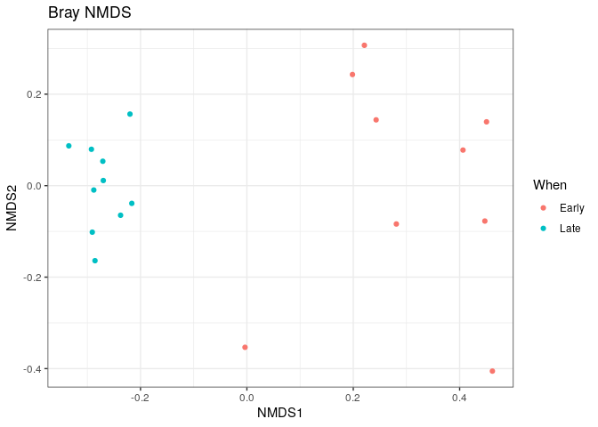
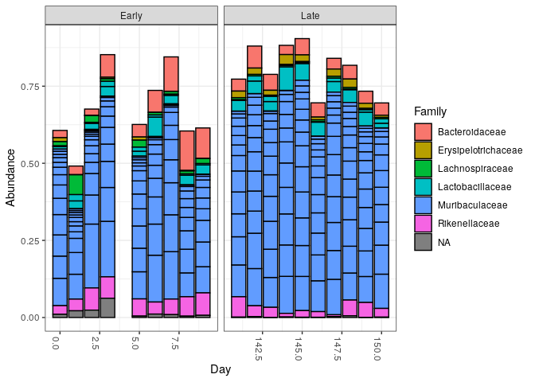

R Notebook
================

``` r
library(dada2) 
```

    ## Loading required package: Rcpp

``` r
install.packages("Rcpp")
```

    ## Installing package into '/usr/local/lib/R/site-library'
    ## (as 'lib' is unspecified)

``` r
library(dada2)
packageVersion("dada2")
```

    ## [1] '1.28.0'

``` r
install.packages("Rcpp")
```

    ## Installing package into '/usr/local/lib/R/site-library'
    ## (as 'lib' is unspecified)

``` r
path <- "/home/rstudio/essai-dada2/MiSeq_SOP" # Cela attribue à la variable path le chemin du dossier MiSeq_SOP qui se trouve dans home rstudio.
list.files(path) # Cette fonction affiche la liste des fichiers dans le répertoire spécifié par path.
```

    ##  [1] "F3D0_S188_L001_R1_001.fastq"   "F3D0_S188_L001_R2_001.fastq"  
    ##  [3] "F3D1_S189_L001_R1_001.fastq"   "F3D1_S189_L001_R2_001.fastq"  
    ##  [5] "F3D141_S207_L001_R1_001.fastq" "F3D141_S207_L001_R2_001.fastq"
    ##  [7] "F3D142_S208_L001_R1_001.fastq" "F3D142_S208_L001_R2_001.fastq"
    ##  [9] "F3D143_S209_L001_R1_001.fastq" "F3D143_S209_L001_R2_001.fastq"
    ## [11] "F3D144_S210_L001_R1_001.fastq" "F3D144_S210_L001_R2_001.fastq"
    ## [13] "F3D145_S211_L001_R1_001.fastq" "F3D145_S211_L001_R2_001.fastq"
    ## [15] "F3D146_S212_L001_R1_001.fastq" "F3D146_S212_L001_R2_001.fastq"
    ## [17] "F3D147_S213_L001_R1_001.fastq" "F3D147_S213_L001_R2_001.fastq"
    ## [19] "F3D148_S214_L001_R1_001.fastq" "F3D148_S214_L001_R2_001.fastq"
    ## [21] "F3D149_S215_L001_R1_001.fastq" "F3D149_S215_L001_R2_001.fastq"
    ## [23] "F3D150_S216_L001_R1_001.fastq" "F3D150_S216_L001_R2_001.fastq"
    ## [25] "F3D2_S190_L001_R1_001.fastq"   "F3D2_S190_L001_R2_001.fastq"  
    ## [27] "F3D3_S191_L001_R1_001.fastq"   "F3D3_S191_L001_R2_001.fastq"  
    ## [29] "F3D5_S193_L001_R1_001.fastq"   "F3D5_S193_L001_R2_001.fastq"  
    ## [31] "F3D6_S194_L001_R1_001.fastq"   "F3D6_S194_L001_R2_001.fastq"  
    ## [33] "F3D7_S195_L001_R1_001.fastq"   "F3D7_S195_L001_R2_001.fastq"  
    ## [35] "F3D8_S196_L001_R1_001.fastq"   "F3D8_S196_L001_R2_001.fastq"  
    ## [37] "F3D9_S197_L001_R1_001.fastq"   "F3D9_S197_L001_R2_001.fastq"  
    ## [39] "filtered"                      "HMP_MOCK.v35.fasta"           
    ## [41] "Mock_S280_L001_R1_001.fastq"   "Mock_S280_L001_R2_001.fastq"  
    ## [43] "mouse.dpw.metadata"            "mouse.time.design"            
    ## [45] "stability.batch"               "stability.files"

``` r
# Forward and reverse fastq filenames have format: SAMPLENAME_R1_001.fastq and SAMPLENAME_R2_001.fastq
fnFs <- sort(list.files(path, pattern="_R1_001.fastq", full.names = TRUE))# création d' une variable fnFs contenant la liste triée de tous les fichiers fastq pour les lectures avant, présents dans le répertoire spécifié, en utilisant les noms qui contiennent _R1_001.fastq.

fnRs <- sort(list.files(path, pattern="_R2_001.fastq", full.names = TRUE)) # création d' une variable fnRs contenant la liste triée de tous les fichiers fastq pour les lectures reverse, présents dans le répertoire spécifié, en utilisant les noms qui contiennent _R2_001.fastq.
# Extract sample names, assuming filenames have format: SAMPLENAME_XXX.fastq

sample.names <- sapply(strsplit(basename(fnFs), "_"), `[`, 1)  # Elle divise chaque nom de fichier en parties basées sur les _, et elle garde uniquement la première partie (le nom de l'échantillon) avant le premier _. 
```

``` r
library(dada2)
```

``` r
install.packages("Rcpp")
```

    ## Installing package into '/usr/local/lib/R/site-library'
    ## (as 'lib' is unspecified)

``` r
library(dada2)
```

``` r
install.packages("Rcpp")
```

    ## Installing package into '/usr/local/lib/R/site-library'
    ## (as 'lib' is unspecified)

``` r
library(dada2)
```

``` r
plotQualityProfile(fnFs[1:2]) # Tracer le profil de qualité des fichiers fastq fnFs pour les deux premiers fichiers. le score de qualité permet d'indiquer la fiabilité d'une base dans les données de sequencage, plus le score est elevé plus cette base est fiable.l'interpretation du graphe:on observe que le score de qualité est plus élevé au  début de lecture (bases au début), et il diminue à la fin de la lecture(dernières bases) , cela peut indiquer qu'il y a de la perte de qualité, ainsi une coupe des lectures peut être nécessaire pour éliminer ces mauvaises sections.
```

<!-- -->

``` r
plotQualityProfile(fnRs[1:2]) # Tracer le profil de qualité des fichiers fastq fnRs pour les deux premiers fichiers. le score de qualité permet d'indiquer la fiabilité d'une base dans les données de sequencage, plus le score est elevé plus cette base est fiable.l'interpretation du graphe:on observe que le score de qualité est plus élevé au  début de lecture (bases au début), et il diminue à la fin de la lecture(dernières bases) , cela peut indiquer qu'il y a de la perte de qualité, ainsi une coupe des lectures peut être nécessaire pour éliminer ces mauvaises sections.
```

<!-- -->

``` r
# Place filtered files in filtered/ subdirectory
filtFs <- file.path(path, "filtered", paste0(sample.names, "_F_filt.fastq.gz"))# création d'un vecteur filtFs contenant les chemins d'accès complets vers les fichiers filtrés des séquences Fs, en les enregistrant dans le répertoire "filtered" sous un nom de fichier correspondant à chaque échantillon.
filtRs <- file.path(path, "filtered", paste0(sample.names, "_R_filt.fastq.gz"))#création d'un vecteur filtFs contenant les chemins d'accès complets vers les fichiers filtrés des séquences Rs, en les enregistrant dans le répertoire "filtered" sous un nom de fichier correspondant à chaque échantillon.
names(filtFs) <- sample.names# Chaque fichier dans filtFs sera étiqueté avec un nom d'échantillon contenant dans sample.names.
names(filtRs) <- sample.names # Chaque fichier dans filtRs sera étiqueté avec un nom déchantillon contenant dans sample.names.
```

``` r
out <- filterAndTrim(fnFs, filtFs, fnRs, filtRs, truncLen=c(240,160),
              maxN=0, maxEE=c(2,2), truncQ=2, rm.phix=TRUE,
              compress=TRUE, multithread=FALSE) # On Windows set multithread=FALSE
head(out) # Cette ligne de code exécute le filtrage et le nettoyage des séquences FASTQ pour plusieurs échantillons, en utilisant des paramètres tels que la longueur de coupe(Les séquences sont coupées à 240 bases pour les séquences forward (fnFs) et à 160 bases pour les séquences reverse (fnRs)), le seuil d'erreur maximal maxEE=(2,2) (Les séquences avec un nombre d'erreurs cumulées supérieur à 2 seront éliminées), maxN=0 (Si une séquence contient une base N, elle sera rejetée) truncQ=2 (Les bases ayant un score de qualité inférieur à 2 (Phred < 2) seront coupées ou supprimées) rm.phix= true (retirer les sequences de phix), compress=True(les fichiers filtrés seront compressés au format gzip).La variable out contient le résultat de la fonction filterAndTrim(), data.frame qui contient des informations sur le nombre de séquences avant et après le filtrage.
```

    ##                               reads.in reads.out
    ## F3D0_S188_L001_R1_001.fastq       7793      7113
    ## F3D1_S189_L001_R1_001.fastq       5869      5299
    ## F3D141_S207_L001_R1_001.fastq     5958      5463
    ## F3D142_S208_L001_R1_001.fastq     3183      2914
    ## F3D143_S209_L001_R1_001.fastq     3178      2941
    ## F3D144_S210_L001_R1_001.fastq     4827      4312

``` r
errF <- learnErrors(filtFs, multithread=TRUE)# learnErrors() dans DADA2 apprend un modèle d'erreur pour les séquences forward  afin de corriger les erreurs de séquençage. Elle utilise les séquences filtrées (contenues dans filtFs) pour estimer les erreurs de séquençage typiques (substitutions, insertions, etc.).errF : L'objet contenant le modèle d'erreur appris pour les séquences forward. 
```

    ## 33514080 total bases in 139642 reads from 20 samples will be used for learning the error rates.

``` r
errR <- learnErrors(filtRs, multithread=TRUE)# apprend un modèle d'erreur pour les séquences reverse pour corriger les erreurs.
```

    ## 22342720 total bases in 139642 reads from 20 samples will be used for learning the error rates.

``` r
plotErrors(errF, nominalQ=TRUE)# génère un graphique qui montre les erreurs de séquençage apprises dans les séquences forward (errF). Le graphique aide à visualiser le taux d'erreur en fonction des scores de qualité (Phred), et à évaluer la qualité globale de vos données de séquençage, nominalQ= TRUE Cela signifie que les scores de qualité (Q-scores) sur l'axe des ordonnées du graphique seront affichés avec les valeurs nominales, c'est-à-dire les valeurs en Phred.
```

    ## Warning: Transformation introduced infinite values in continuous y-axis
    ## Transformation introduced infinite values in continuous y-axis

<!-- -->

``` r
dadaFs <- dada(filtFs, err=errF, multithread=TRUE)# la fonction dada  prend les séquences filtrées forward  et le modèle d'erreur estimé, et utilise une approche basée sur le maximum de vraisemblance pour identifier les variantes exactes de séquences (appelées ASVs pour "Amplicon Sequence Variants") les résultats indiquent que sample 1: on a 7113 reads(fragments d'adn sequencés apres le filtrage) et dans ces 7113 seq on a 1979 sequences uniques 
```

    ## Sample 1 - 7113 reads in 1979 unique sequences.
    ## Sample 2 - 5299 reads in 1639 unique sequences.
    ## Sample 3 - 5463 reads in 1477 unique sequences.
    ## Sample 4 - 2914 reads in 904 unique sequences.
    ## Sample 5 - 2941 reads in 939 unique sequences.
    ## Sample 6 - 4312 reads in 1267 unique sequences.
    ## Sample 7 - 6741 reads in 1756 unique sequences.
    ## Sample 8 - 4560 reads in 1438 unique sequences.
    ## Sample 9 - 15637 reads in 3590 unique sequences.
    ## Sample 10 - 11413 reads in 2762 unique sequences.
    ## Sample 11 - 12017 reads in 3021 unique sequences.
    ## Sample 12 - 5032 reads in 1566 unique sequences.
    ## Sample 13 - 18075 reads in 3707 unique sequences.
    ## Sample 14 - 6250 reads in 1479 unique sequences.
    ## Sample 15 - 4052 reads in 1195 unique sequences.
    ## Sample 16 - 7369 reads in 1832 unique sequences.
    ## Sample 17 - 4765 reads in 1183 unique sequences.
    ## Sample 18 - 4871 reads in 1382 unique sequences.
    ## Sample 19 - 6504 reads in 1709 unique sequences.
    ## Sample 20 - 4314 reads in 897 unique sequences.

``` r
dadaRs <- dada(filtRs, err=errR, multithread=TRUE)#la fonction dada  prend les séquences filtrées reverse   et le modèle d'erreur estimé, et utilise une approche basée sur le maximum de vraisemblance pour identifier les variantes exactes de séquences (appelées ASVs pour "Amplicon Sequence Variants")
```

    ## Sample 1 - 7113 reads in 1660 unique sequences.
    ## Sample 2 - 5299 reads in 1349 unique sequences.
    ## Sample 3 - 5463 reads in 1335 unique sequences.
    ## Sample 4 - 2914 reads in 853 unique sequences.
    ## Sample 5 - 2941 reads in 880 unique sequences.
    ## Sample 6 - 4312 reads in 1286 unique sequences.
    ## Sample 7 - 6741 reads in 1803 unique sequences.
    ## Sample 8 - 4560 reads in 1265 unique sequences.
    ## Sample 9 - 15637 reads in 3414 unique sequences.
    ## Sample 10 - 11413 reads in 2522 unique sequences.
    ## Sample 11 - 12017 reads in 2771 unique sequences.
    ## Sample 12 - 5032 reads in 1415 unique sequences.
    ## Sample 13 - 18075 reads in 3290 unique sequences.
    ## Sample 14 - 6250 reads in 1390 unique sequences.
    ## Sample 15 - 4052 reads in 1134 unique sequences.
    ## Sample 16 - 7369 reads in 1635 unique sequences.
    ## Sample 17 - 4765 reads in 1084 unique sequences.
    ## Sample 18 - 4871 reads in 1161 unique sequences.
    ## Sample 19 - 6504 reads in 1502 unique sequences.
    ## Sample 20 - 4314 reads in 732 unique sequences.

``` r
dadaFs[[1]]# Elle va nous montrer les ASVs et leurs abondances dans le premier échantillon.
```

    ## dada-class: object describing DADA2 denoising results
    ## 128 sequence variants were inferred from 1979 input unique sequences.
    ## Key parameters: OMEGA_A = 1e-40, OMEGA_C = 1e-40, BAND_SIZE = 16

``` r
mergers <- mergePairs(dadaFs, filtFs, dadaRs, filtRs, verbose=TRUE)
```

    ## 6540 paired-reads (in 107 unique pairings) successfully merged out of 6891 (in 197 pairings) input.

    ## 5028 paired-reads (in 101 unique pairings) successfully merged out of 5190 (in 157 pairings) input.

    ## 4986 paired-reads (in 81 unique pairings) successfully merged out of 5267 (in 166 pairings) input.

    ## 2595 paired-reads (in 52 unique pairings) successfully merged out of 2754 (in 108 pairings) input.

    ## 2553 paired-reads (in 60 unique pairings) successfully merged out of 2785 (in 119 pairings) input.

    ## 3646 paired-reads (in 55 unique pairings) successfully merged out of 4109 (in 157 pairings) input.

    ## 6079 paired-reads (in 81 unique pairings) successfully merged out of 6514 (in 198 pairings) input.

    ## 3968 paired-reads (in 91 unique pairings) successfully merged out of 4388 (in 187 pairings) input.

    ## 14233 paired-reads (in 143 unique pairings) successfully merged out of 15355 (in 352 pairings) input.

    ## 10528 paired-reads (in 120 unique pairings) successfully merged out of 11165 (in 278 pairings) input.

    ## 11154 paired-reads (in 137 unique pairings) successfully merged out of 11797 (in 298 pairings) input.

    ## 4349 paired-reads (in 85 unique pairings) successfully merged out of 4802 (in 179 pairings) input.

    ## 17431 paired-reads (in 153 unique pairings) successfully merged out of 17812 (in 272 pairings) input.

    ## 5850 paired-reads (in 81 unique pairings) successfully merged out of 6095 (in 159 pairings) input.

    ## 3716 paired-reads (in 86 unique pairings) successfully merged out of 3894 (in 147 pairings) input.

    ## 6865 paired-reads (in 99 unique pairings) successfully merged out of 7191 (in 187 pairings) input.

    ## 4426 paired-reads (in 67 unique pairings) successfully merged out of 4603 (in 127 pairings) input.

    ## 4576 paired-reads (in 101 unique pairings) successfully merged out of 4739 (in 174 pairings) input.

    ## 6092 paired-reads (in 109 unique pairings) successfully merged out of 6315 (in 173 pairings) input.

    ## 4269 paired-reads (in 20 unique pairings) successfully merged out of 4281 (in 28 pairings) input.

``` r
# Inspect the merger data.frame from the first sample  cette fonction te permet de fusionner les lectures forward et reverse pour obtenir des séquences plus complètes
head(mergers[[1]])# permet de  montrer un aperçu des premières séquences fusionnées pour le premier échantillon dans l'objet mergers
```

    ##                                                                                                                                                                                                                                                       sequence
    ## 1 TACGGAGGATGCGAGCGTTATCCGGATTTATTGGGTTTAAAGGGTGCGCAGGCGGAAGATCAAGTCAGCGGTAAAATTGAGAGGCTCAACCTCTTCGAGCCGTTGAAACTGGTTTTCTTGAGTGAGCGAGAAGTATGCGGAATGCGTGGTGTAGCGGTGAAATGCATAGATATCACGCAGAACTCCGATTGCGAAGGCAGCATACCGGCGCTCAACTGACGCTCATGCACGAAAGTGTGGGTATCGAACAGG
    ## 2 TACGGAGGATGCGAGCGTTATCCGGATTTATTGGGTTTAAAGGGTGCGTAGGCGGCCTGCCAAGTCAGCGGTAAAATTGCGGGGCTCAACCCCGTACAGCCGTTGAAACTGCCGGGCTCGAGTGGGCGAGAAGTATGCGGAATGCGTGGTGTAGCGGTGAAATGCATAGATATCACGCAGAACCCCGATTGCGAAGGCAGCATACCGGCGCCCTACTGACGCTGAGGCACGAAAGTGCGGGGATCAAACAGG
    ## 3 TACGGAGGATGCGAGCGTTATCCGGATTTATTGGGTTTAAAGGGTGCGTAGGCGGGCTGTTAAGTCAGCGGTCAAATGTCGGGGCTCAACCCCGGCCTGCCGTTGAAACTGGCGGCCTCGAGTGGGCGAGAAGTATGCGGAATGCGTGGTGTAGCGGTGAAATGCATAGATATCACGCAGAACTCCGATTGCGAAGGCAGCATACCGGCGCCCGACTGACGCTGAGGCACGAAAGCGTGGGTATCGAACAGG
    ## 4 TACGGAGGATGCGAGCGTTATCCGGATTTATTGGGTTTAAAGGGTGCGTAGGCGGGCTTTTAAGTCAGCGGTAAAAATTCGGGGCTCAACCCCGTCCGGCCGTTGAAACTGGGGGCCTTGAGTGGGCGAGAAGAAGGCGGAATGCGTGGTGTAGCGGTGAAATGCATAGATATCACGCAGAACCCCGATTGCGAAGGCAGCCTTCCGGCGCCCTACTGACGCTGAGGCACGAAAGTGCGGGGATCGAACAGG
    ## 5 TACGGAGGATGCGAGCGTTATCCGGATTTATTGGGTTTAAAGGGTGCGCAGGCGGACTCTCAAGTCAGCGGTCAAATCGCGGGGCTCAACCCCGTTCCGCCGTTGAAACTGGGAGCCTTGAGTGCGCGAGAAGTAGGCGGAATGCGTGGTGTAGCGGTGAAATGCATAGATATCACGCAGAACTCCGATTGCGAAGGCAGCCTACCGGCGCGCAACTGACGCTCATGCACGAAAGCGTGGGTATCGAACAGG
    ## 6 TACGGAGGATGCGAGCGTTATCCGGATTTATTGGGTTTAAAGGGTGCGTAGGCGGGATGCCAAGTCAGCGGTAAAAAAGCGGTGCTCAACGCCGTCGAGCCGTTGAAACTGGCGTTCTTGAGTGGGCGAGAAGTATGCGGAATGCGTGGTGTAGCGGTGAAATGCATAGATATCACGCAGAACTCCGATTGCGAAGGCAGCATACCGGCGCCCTACTGACGCTGAGGCACGAAAGCGTGGGTATCGAACAGG
    ##   abundance forward reverse nmatch nmismatch nindel prefer accept
    ## 1       579       1       1    148         0      0      1   TRUE
    ## 2       470       2       2    148         0      0      2   TRUE
    ## 3       449       3       4    148         0      0      1   TRUE
    ## 4       430       4       3    148         0      0      2   TRUE
    ## 5       345       5       6    148         0      0      1   TRUE
    ## 6       282       6       5    148         0      0      2   TRUE

``` r
seqtab <- makeSequenceTable(mergers)# Cette commande crée une table de séquences à partir des résultats de la fusion des lectures paired-end, où chaque ASV est représentée par une colonne et l'abondance dans chaque échantillon par une ligne. Elle te permet d'obtenir un résumé complet des ASVs détectées et de leur abondance dans tes échantillons.
dim(seqtab) #dim(seqtab) renvoie un vecteur contenant les dimensions de la table de séquences (le nombre d'échantillons et d'ASVs). l'interpretation du résultat : Il y a 20 échantillons dans la table de séquences (chaque échantillon correspond à une ligne dans la table). 293 : Il y a 293 ASVs (Amplicon Sequence Variants) détectées dans les échantillons (chaque ASV correspond à une colonne dans la table).
```

    ## [1]  20 293

``` r
table(nchar(getSequences(seqtab))) #Extrait toutes les séquences (ASVs) de la table de séquences. nchar() : Calcule la longueur de chaque ASV. table() : Compte combien d'ASVs ont une longueur donnée. l'interpretation des résultats: 88 ASV ont une longueur de 252 bases
```

    ## 
    ## 251 252 253 254 255 
    ##   1  88 196   6   2

``` r
seqtab.nochim <- removeBimeraDenovo(seqtab, method="consensus", multithread=TRUE, verbose=TRUE)#Supprime les séquences chimériques de la table seqtab.
```

    ## Identified 61 bimeras out of 293 input sequences.

``` r
dim(seqtab.nochim)#Renvoie les dimensions de la table après élimination des chimères, te montrant combien d'échantillons et d'ASVs restent après cette étape de nettoyage.l'interpretation des résultats: il reste 20 échantillons, 61 chiméres ont été identifiés il reste ainsi 232 ASV
```

    ## [1]  20 232

``` r
sum(seqtab.nochim)/sum(seqtab)# elle permet de calculer la proportion de séquences non chimériques après suppression des chimères, par rapport à l'ensemble des séquences initiales. l'interprétation des résultats  signifie que 96.4% des séquences dans ta table initiale (avant la suppression des chimères) étaient non chimériques et ont été conservées dans la table seqtab.nochim après l'élimination des chimères.
```

    ## [1] 0.9640374

``` r
getN <- function(x) sum(getUniques(x))# getN est une fonction définie pour calculer la somme des séquences uniques dans un objet DADA2.getUniques(x) extrait les séquences uniques de l'objet x.sum(getUniques(x)) additionne ces séquences uniques pour obtenir une somme totale ou abondance.
track <- cbind(out, sapply(dadaFs, getN), sapply(dadaRs, getN), sapply(mergers, getN), rowSums(seqtab.nochim))#crée une table nommée track avec les colonnes suivantes :out : Nombre de séquences après filterAndTrim().sapply(dadaFs, getN) : Nombre de séquences uniques après dénucléotidation des lectures forward. sapply(dadaRs, getN) : Nombre de séquences uniques après dénucléotidation des lectures reverse.sapply(mergers, getN) : Nombre de séquences uniques après fusion des lectures forward et reverse.rowSums(seqtab.nochim) : Nombre total d'ASVs non chimériques après élimination des chimères.
# If processing a single sample, remove the sapply calls: e.g. replace sapply(dadaFs, getN) with getN(dadaFs)
colnames(track) <- c("input", "filtered", "denoisedF", "denoisedR", "merged", "nonchim")
rownames(track) <- sample.names
head(track)#colnames(track) attribue des noms de colonnes explicites à la table track pour clarifier les différentes étapes du traitement.rownames(track) associe chaque ligne de la table à un échantillon spécifique, basé sur sample.names.head(track) affiche les premières lignes de la table pour que tu puisses vérifier les données et voir comment les séquences évoluent à travers chaque étape du pipeline DADA2.
```

    ##        input filtered denoisedF denoisedR merged nonchim
    ## F3D0    7793     7113      6976      6979   6540    6528
    ## F3D1    5869     5299      5227      5239   5028    5017
    ## F3D141  5958     5463      5331      5357   4986    4863
    ## F3D142  3183     2914      2799      2830   2595    2521
    ## F3D143  3178     2941      2822      2868   2553    2519
    ## F3D144  4827     4312      4151      4228   3646    3507

``` r
taxa <- assignTaxonomy(seqtab.nochim, "/home/rstudio/essai-dada2/silva_nr_v132_train_set.fa.gz?download=1", multithread=TRUE)#la commande assignTaxonomy() affecte des classifications taxonomiques aux séquences uniques ou ASVs présentes dans seqtab.nochim, en utilisant une base de données de séquences  SILVA.Elle attribue des groupes taxonomiques aux ASVs à partir du phylum jusqu'à l'espèce, et le résultat est stocké dans taxa, un data frame contenant la classification de chaque ASV.
```

``` r
taxa.print <- taxa # Removing sequence rownames for display only
rownames(taxa.print) <- NULL
head(taxa.print)#taxa.print <- taxa : Crée une copie de taxa.rownames(taxa.print) <- NULL : Supprime les noms de séquences (ASVs) dans taxa.print.head(taxa.print) : Affiche les premières lignes de la table sans les noms de séquences, montrant uniquement les informations taxonomiques.Cette procédure permet de simplifier l'affichage de la table pour se concentrer sur les données taxonomiques, rendant le tableau plus lisible et facile à interpréter.
```

    ##      Kingdom    Phylum          Class         Order           Family          
    ## [1,] "Bacteria" "Bacteroidetes" "Bacteroidia" "Bacteroidales" "Muribaculaceae"
    ## [2,] "Bacteria" "Bacteroidetes" "Bacteroidia" "Bacteroidales" "Muribaculaceae"
    ## [3,] "Bacteria" "Bacteroidetes" "Bacteroidia" "Bacteroidales" "Muribaculaceae"
    ## [4,] "Bacteria" "Bacteroidetes" "Bacteroidia" "Bacteroidales" "Muribaculaceae"
    ## [5,] "Bacteria" "Bacteroidetes" "Bacteroidia" "Bacteroidales" "Bacteroidaceae"
    ## [6,] "Bacteria" "Bacteroidetes" "Bacteroidia" "Bacteroidales" "Muribaculaceae"
    ##      Genus        
    ## [1,] NA           
    ## [2,] NA           
    ## [3,] NA           
    ## [4,] NA           
    ## [5,] "Bacteroides"
    ## [6,] NA

``` r
unqs.mock <- seqtab.nochim["Mock",]
unqs.mock <- sort(unqs.mock[unqs.mock>0], decreasing=TRUE) # Drop ASVs absent in the Mock
cat("DADA2 inferred", length(unqs.mock), "sample sequences present in the Mock community.\n")#Ce code permet d'extraire, filtrer et trier les séquences uniques détectées dans un échantillon Mock, puis affiche combien d'ASVs ont été identifiées dans cet échantillon de contrôle.
```

    ## DADA2 inferred 20 sample sequences present in the Mock community.

``` r
mock.ref <- getSequences(file.path(path, "HMP_MOCK.v35.fasta"))
match.ref <- sum(sapply(names(unqs.mock), function(x) any(grepl(x, mock.ref))))
cat("Of those,", sum(match.ref), "were exact matches to the expected reference sequences.\n")#le fichier HMP_MOCK.v35.fasta est lu et stocké dans mock.ref.Vérification des correspondances : Pour chaque ASV détectée dans l'échantillon Mock, on vérifie si son nom apparaît dans les séquences de référence mock.ref. Si oui, cette ASV est considérée comme une correspondance.Affichage du résultat : Le nombre d'ASVs qui correspondent exactement aux séquences de référence est affiché avec un message.
```

    ## Of those, 20 were exact matches to the expected reference sequences.

``` r
library(phyloseq)
```

``` r
packageVersion("phyloseq")
```

    ## [1] '1.44.0'

``` r
packageVersion("phyloseq")
```

    ## [1] '1.44.0'

``` r
library(Biostrings)
```

    ## Loading required package: BiocGenerics

    ## 
    ## Attaching package: 'BiocGenerics'

    ## The following objects are masked from 'package:stats':
    ## 
    ##     IQR, mad, sd, var, xtabs

    ## The following objects are masked from 'package:base':
    ## 
    ##     anyDuplicated, aperm, append, as.data.frame, basename, cbind,
    ##     colnames, dirname, do.call, duplicated, eval, evalq, Filter, Find,
    ##     get, grep, grepl, intersect, is.unsorted, lapply, Map, mapply,
    ##     match, mget, order, paste, pmax, pmax.int, pmin, pmin.int,
    ##     Position, rank, rbind, Reduce, rownames, sapply, setdiff, sort,
    ##     table, tapply, union, unique, unsplit, which.max, which.min

    ## Loading required package: S4Vectors

    ## Loading required package: stats4

    ## 
    ## Attaching package: 'S4Vectors'

    ## The following object is masked from 'package:utils':
    ## 
    ##     findMatches

    ## The following objects are masked from 'package:base':
    ## 
    ##     expand.grid, I, unname

    ## Loading required package: IRanges

    ## 
    ## Attaching package: 'IRanges'

    ## The following object is masked from 'package:phyloseq':
    ## 
    ##     distance

    ## Loading required package: XVector

    ## Loading required package: GenomeInfoDb

    ## 
    ## Attaching package: 'Biostrings'

    ## The following object is masked from 'package:base':
    ## 
    ##     strsplit

``` r
packageVersion("Biostrings")
```

    ## [1] '2.68.1'

``` r
library(ggplot2)
```

``` r
packageVersion("ggplot2")
```

    ## [1] '3.4.3'

``` r
theme_set(theme_bw())#configure ggplot2 pour que tous les graphiques générés après cette commande aient un fond blanc avec des axes noirs, offrant un style visuel noir et blanc
```

``` r
samples.out <- rownames(seqtab.nochim)#extrait les noms des échantillons de la table des séquences non chimériques seqtab.nochim et les stocke dans la variable samples.out.
subject <- sapply(strsplit(samples.out, "D"), `[`, 1)#permet de diviser les noms d'échantillons en utilisant "D" comme séparateur et d'extraire la partie avant le "D". Le résultat est stocké dans la variable subject.
gender <- substr(subject,1,1)#extrait le premier caractère de chaque élément dans la variable subject et le stocke dans la variable gender
subject <- substr(subject,2,999)#permet d'exclure le premier caractère de chaque élément dans la variable subject, en gardant uniquement le reste de la chaîne, à partir du deuxième caractère jusqu'à la fin.
day <- as.integer(sapply(strsplit(samples.out, "D"), `[`, 2))
samdf <- data.frame(Subject=subject, Gender=gender, Day=day)
samdf$When <- "Early"
samdf$When[samdf$Day>100] <- "Late"
rownames(samdf) <- samples.out #  Extrait les numéros de jour des noms d'échantillons (extrait la partie après "D" et la convertit en entier).Crée un data frame samdf avec les colonnes : Subject, Gender, et Day.Ajoute une colonne When, initialisée à "Early".Modifie la colonne When à "Late" pour les lignes où Day est supérieur à 100.Définit les noms des lignes du data frame samdf en fonction des noms des échantillons dans samples.out. en résumé ce code permet de créer un tableau d'échantillons avec des informations sur le sujet, le genre, le jour, et la phase (early ou late ) de l'échantillon en fonction du jour de prélèvement.
```

``` r
ps <- phyloseq(otu_table(seqtab.nochim, taxa_are_rows=FALSE), 
               sample_data(samdf), 
               tax_table(taxa))#crée un objet phyloseq en combinant trois types de données :Table des séquences (ASV) (seqtab.nochim), avec les séquences non chimériques.Métadonnées des échantillons (samdf), contenant des informations sur les échantillons (comme le genre, le jour, la phase).Table de taxonomie (taxa), contenant la classification taxonomique des séquences (ASV).
ps <- prune_samples(sample_names(ps) != "Mock", ps) # Remove mock sample
```

``` r
dna <- Biostrings::DNAStringSet(taxa_names(ps))
names(dna) <- taxa_names(ps)
ps <- merge_phyloseq(ps, dna)
taxa_names(ps) <- paste0("ASV", seq(ntaxa(ps)))
ps 
```

    ## phyloseq-class experiment-level object
    ## otu_table()   OTU Table:         [ 232 taxa and 19 samples ]
    ## sample_data() Sample Data:       [ 19 samples by 4 sample variables ]
    ## tax_table()   Taxonomy Table:    [ 232 taxa by 6 taxonomic ranks ]
    ## refseq()      DNAStringSet:      [ 232 reference sequences ]

``` r
#crée un objet DNAStringSet à partir des noms de séquences (ASV) dans l'objet phyloseq (ps), dna <- Biostrings::DNAStringSet(taxa_names(ps)) : Récupère les noms des séquences (ASV) et les convertit en une structure de données DNAStringSet, names(dna) <- taxa_names(ps) : Associe les noms des séquences à l'objet dna.Ajoute cet objet dna à l'objet phyloseq (ps) en tant que données supplémentaires :ps <- merge_phyloseq(ps, dna) : Fusionne les informations de séquences (dna) avec l'objet phyloseq existant.Renomme les noms taxonomiques des ASV pour les formater comme "ASV1", "ASV2", etc. :taxa_names(ps) <- paste0("ASV", seq(ntaxa(ps))) : Renomme les ASV dans l'objet phyloseq avec un format numérique séquentiel (ASV1, ASV2, etc.).
```

``` r
plot_richness(ps, x="Day", measures=c("Shannon", "Simpson"), color="When")#Cette commande produit un graphique de diversité alpha (richesse des communautés) en utilisant les indices de diversité Shannon et Simpson, avec les échantillons regroupés par "Day" et colorés par "When" pour montrer la variation de la diversité entre les différentes phases (Early et Late). Ce type de graphique permet d'explorer comment la diversité change au fil du temps et entre les groupes de traitements.
```

    ## Warning in estimate_richness(physeq, split = TRUE, measures = measures): The data you have provided does not have
    ## any singletons. This is highly suspicious. Results of richness
    ## estimates (for example) are probably unreliable, or wrong, if you have already
    ## trimmed low-abundance taxa from the data.
    ## 
    ## We recommended that you find the un-trimmed data and retry.

<!-- -->

``` r
# Transform data to proportions as appropriate for Bray-Curtis distances
ps.prop <- transform_sample_counts(ps, function(otu) otu/sum(otu))
ord.nmds.bray <- ordinate(ps.prop, method="NMDS", distance="bray")#Normalisation des comptes : Il transforme les comptes d'OTU/ASV dans chaque échantillon en proportions relatives, afin de comparer les abondances des taxons entre les échantillons de manière proportionnelle, plutôt qu'absolue.Analyse NMDS : Il effectue une ordination NMDS basée sur la distance de Bray-Curtis, afin de visualiser les relations de similarité ou de dissimilarité entre les échantillons en réduisant la dimensionnalité des données.
```

    ## Run 0 stress 0.08043117 
    ## Run 1 stress 0.08076338 
    ## ... Procrustes: rmse 0.01053688  max resid 0.03243511 
    ## Run 2 stress 0.08616061 
    ## Run 3 stress 0.09477218 
    ## Run 4 stress 0.094771 
    ## Run 5 stress 0.09477177 
    ## Run 6 stress 0.08043117 
    ## ... New best solution
    ## ... Procrustes: rmse 9.14342e-07  max resid 2.011288e-06 
    ## ... Similar to previous best
    ## Run 7 stress 0.08076338 
    ## ... Procrustes: rmse 0.01052123  max resid 0.03238404 
    ## Run 8 stress 0.09477201 
    ## Run 9 stress 0.08076339 
    ## ... Procrustes: rmse 0.01054086  max resid 0.03244799 
    ## Run 10 stress 0.08616061 
    ## Run 11 stress 0.08076337 
    ## ... Procrustes: rmse 0.01049491  max resid 0.03229792 
    ## Run 12 stress 0.08076336 
    ## ... Procrustes: rmse 0.01048071  max resid 0.03225223 
    ## Run 13 stress 0.08043117 
    ## ... New best solution
    ## ... Procrustes: rmse 2.16379e-06  max resid 5.585936e-06 
    ## ... Similar to previous best
    ## Run 14 stress 0.08616061 
    ## Run 15 stress 0.08616061 
    ## Run 16 stress 0.08076339 
    ## ... Procrustes: rmse 0.01055532  max resid 0.03249396 
    ## Run 17 stress 0.09477212 
    ## Run 18 stress 0.08076338 
    ## ... Procrustes: rmse 0.01054166  max resid 0.03244921 
    ## Run 19 stress 0.08043117 
    ## ... New best solution
    ## ... Procrustes: rmse 1.555828e-06  max resid 3.419275e-06 
    ## ... Similar to previous best
    ## Run 20 stress 0.08616061 
    ## *** Best solution repeated 1 times

``` r
plot_ordination(ps.prop, ord.nmds.bray, color="When", title="Bray NMDS")# Cette commande génère un graphique NMDS pour visualiser les similarités entre les échantillons, en coloriant les échantillons selon la variable "When". Cela permet de voir si les échantillons des phases Early et Late se regroupent ou se séparent dans l'espace ordonné.
```

<!-- -->

``` r
top20 <- names(sort(taxa_sums(ps), decreasing=TRUE))[1:20]
ps.top20 <- transform_sample_counts(ps, function(OTU) OTU/sum(OTU))
ps.top20 <- prune_taxa(top20, ps.top20)
plot_bar(ps.top20, x="Day", fill="Family") + facet_wrap(~When, scales="free_x")# Ce code sélectionne les 20 ASVs les plus abondants, les normalise en proportions relatives, et génère un barplot des familles taxonomiques, séparé par les périodes "Early" et "Late"
```

<!-- -->
